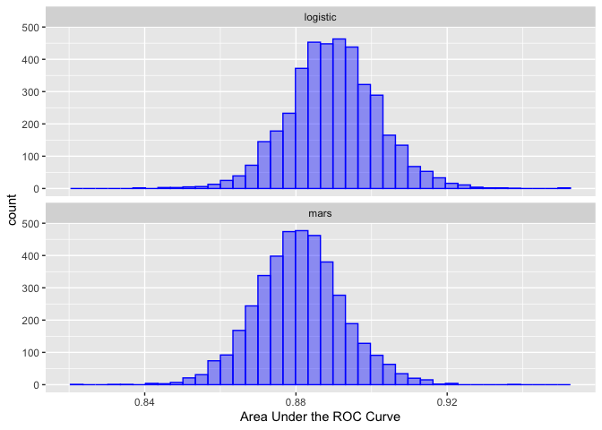

<!-- README.md is generated from README.Rmd. Please edit that file -->

# tidyposterior <a href='https://tidyposterior.tidymodels.org/'></a>

<!-- badges: start -->

[](https://github.com/tidymodels/tidyposterior/actions/workflows/R-CMD-check.yaml)
[](https://app.codecov.io/gh/tidymodels/tidyposterior?branch=main)
[](https://CRAN.r-project.org/package=tidyposterior)
[](https://CRAN.r-project.org/package=tidyposterior)


<!-- badges: end -->

This package can be used to conduct *post hoc* analyses of resampling
results generated by models.

For example, if two models are evaluated with the root mean squared
error (RMSE) using 10-fold cross-validation, there are 10 paired
statistics. These can be used to make comparisons between models without
involving a test set.

There is a rich literature on the analysis of model resampling results
such as McLachlan’s [*Discriminant Analysis and Statistical Pattern
Recognition*](https://books.google.com/books?id=O_qHDLaWpDUC&lpg=PR7&ots=6GJnIREXZM&dq=%22Discriminant%20Analysis%20and%20Statistical%20Pattern%20Recognition%22&lr&pg=PR7#v=onepage&q=%22Discriminant%20Analysis%20and%20Statistical%20Pattern%20Recognition%22&f=false)
and the references therein. This package follows *the spirit* of
[Benavoli *et al*
(2017)](https://people.idsia.ch//~marco/papers/2017jmlr-tests.pdf).

tidyposterior uses Bayesian generalized linear models for this purpose
and can be considered an upgraded version of the
[`caret::resamples()`](https://topepo.github.io/caret/model-training-and-tuning.html#exploring-and-comparing-resampling-distributions)
function. The package works with
[rsample](https://rsample.tidymodels.org/) objects natively but any
results in a data frame can be used.

See [Chapter 11](https://www.tmwr.org/compare.html) of [*Tidy Models
with R*](https://www.tmwr.org) for examples and more details.

## Installation

You can install the released version of tidyposterior from
[CRAN](https://CRAN.R-project.org) with:

``` r
install.packages("tidyposterior")
```

And the development version from [GitHub](https://github.com/) with:

``` r
# install.packages("pak")
pak::pak("tidymodels/tidyposterior")
```

## Example

To illustrate, here are some example objects using 10-fold
cross-validation for a simple two-class problem:

``` r
library(tidymodels)
#> ── Attaching packages ────────────────────────────────────── tidymodels 1.1.0 ──
#> ✔ broom        1.0.5          ✔ recipes      1.0.8     
#> ✔ dials        1.2.0          ✔ rsample      1.2.0     
#> ✔ dplyr        1.1.2          ✔ tibble       3.2.1     
#> ✔ ggplot2      3.4.3          ✔ tidyr        1.3.0     
#> ✔ infer        1.0.4          ✔ tune         1.1.2     
#> ✔ modeldata    1.2.0          ✔ workflows    1.1.3     
#> ✔ parsnip      1.1.1.9000     ✔ workflowsets 1.0.1     
#> ✔ purrr        1.0.2          ✔ yardstick    1.2.0
#> ── Conflicts ───────────────────────────────────────── tidymodels_conflicts() ──
#> ✖ purrr::discard() masks scales::discard()
#> ✖ dplyr::filter()  masks stats::filter()
#> ✖ dplyr::lag()     masks stats::lag()
#> ✖ recipes::step()  masks stats::step()
#> • Search for functions across packages at https://www.tidymodels.org/find/
library(tidyposterior)

data(two_class_dat, package = "modeldata")

set.seed(100)
folds <- vfold_cv(two_class_dat)
```

We can define two different models (for simplicity, with no tuning
parameters).

``` r
logistic_reg_glm_spec <-
  logistic_reg() |>
  set_engine('glm')

mars_earth_spec <-
  mars(prod_degree = 1) |>
  set_engine('earth') |>
  set_mode('classification')
```

For tidymodels, the \[tune::fit_resamples()\] function can be used to
estimate performance for each model/resample:

``` r
rs_ctrl <- control_resamples(save_workflow = TRUE)

logistic_reg_glm_res <- 
  logistic_reg_glm_spec |> 
  fit_resamples(Class ~ ., resamples = folds, control = rs_ctrl)

mars_earth_res <- 
  mars_earth_spec |> 
  fit_resamples(Class ~ ., resamples = folds, control = rs_ctrl)
```

From these, there are several ways to pass the results to the
`perf_mod()` function. The most general approach is to have a data frame
with the resampling labels (i.e., one or more id columns) as well as
columns for each model that you would like to compare.

For the model results above, \[tune::collect_metrics()\] can be used
along with some basic data manipulation steps:

``` r
logistic_roc <- 
  collect_metrics(logistic_reg_glm_res, summarize = FALSE) |> 
  dplyr::filter(.metric == "roc_auc") |> 
  dplyr::select(id, logistic = .estimate)

mars_roc <- 
  collect_metrics(mars_earth_res, summarize = FALSE) |> 
  dplyr::filter(.metric == "roc_auc") |> 
  dplyr::select(id, mars = .estimate)

resamples_df <- full_join(logistic_roc, mars_roc, by = "id")
resamples_df
#> # A tibble: 10 × 3
#>    id     logistic  mars
#>    <chr>     <dbl> <dbl>
#>  1 Fold01    0.856 0.845
#>  2 Fold02    0.933 0.951
#>  3 Fold03    0.934 0.937
#>  4 Fold04    0.864 0.858
#>  5 Fold05    0.847 0.854
#>  6 Fold06    0.911 0.840
#>  7 Fold07    0.867 0.858
#>  8 Fold08    0.886 0.876
#>  9 Fold09    0.898 0.898
#> 10 Fold10    0.906 0.894
```

We can then give this directly to `perf_mod()`:

``` r
set.seed(101)
roc_model_via_df <- perf_mod(resamples_df, iter = 2000)
#> 
#> SAMPLING FOR MODEL 'continuous' NOW (CHAIN 1).
#> Chain 1: 
#> Chain 1: Gradient evaluation took 0.000216 seconds
#> Chain 1: 1000 transitions using 10 leapfrog steps per transition would take 2.16 seconds.
#> Chain 1: Adjust your expectations accordingly!
#> Chain 1: 
#> Chain 1: 
#> Chain 1: Iteration:    1 / 2000 [  0%]  (Warmup)
#> Chain 1: Iteration:  200 / 2000 [ 10%]  (Warmup)
#> Chain 1: Iteration:  400 / 2000 [ 20%]  (Warmup)
#> Chain 1: Iteration:  600 / 2000 [ 30%]  (Warmup)
#> Chain 1: Iteration:  800 / 2000 [ 40%]  (Warmup)
#> Chain 1: Iteration: 1000 / 2000 [ 50%]  (Warmup)
#> Chain 1: Iteration: 1001 / 2000 [ 50%]  (Sampling)
#> Chain 1: Iteration: 1200 / 2000 [ 60%]  (Sampling)
#> Chain 1: Iteration: 1400 / 2000 [ 70%]  (Sampling)
#> Chain 1: Iteration: 1600 / 2000 [ 80%]  (Sampling)
#> Chain 1: Iteration: 1800 / 2000 [ 90%]  (Sampling)
#> Chain 1: Iteration: 2000 / 2000 [100%]  (Sampling)
#> Chain 1: 
#> Chain 1:  Elapsed Time: 0.334 seconds (Warm-up)
#> Chain 1:                0.099 seconds (Sampling)
#> Chain 1:                0.433 seconds (Total)
#> Chain 1: 
#> 
#> SAMPLING FOR MODEL 'continuous' NOW (CHAIN 2).
#> Chain 2: 
#> Chain 2: Gradient evaluation took 5e-06 seconds
#> Chain 2: 1000 transitions using 10 leapfrog steps per transition would take 0.05 seconds.
#> Chain 2: Adjust your expectations accordingly!
#> Chain 2: 
#> Chain 2: 
#> Chain 2: Iteration:    1 / 2000 [  0%]  (Warmup)
#> Chain 2: Iteration:  200 / 2000 [ 10%]  (Warmup)
#> Chain 2: Iteration:  400 / 2000 [ 20%]  (Warmup)
#> Chain 2: Iteration:  600 / 2000 [ 30%]  (Warmup)
#> Chain 2: Iteration:  800 / 2000 [ 40%]  (Warmup)
#> Chain 2: Iteration: 1000 / 2000 [ 50%]  (Warmup)
#> Chain 2: Iteration: 1001 / 2000 [ 50%]  (Sampling)
#> Chain 2: Iteration: 1200 / 2000 [ 60%]  (Sampling)
#> Chain 2: Iteration: 1400 / 2000 [ 70%]  (Sampling)
#> Chain 2: Iteration: 1600 / 2000 [ 80%]  (Sampling)
#> Chain 2: Iteration: 1800 / 2000 [ 90%]  (Sampling)
#> Chain 2: Iteration: 2000 / 2000 [100%]  (Sampling)
#> Chain 2: 
#> Chain 2:  Elapsed Time: 0.333 seconds (Warm-up)
#> Chain 2:                0.138 seconds (Sampling)
#> Chain 2:                0.471 seconds (Total)
#> Chain 2: 
#> 
#> SAMPLING FOR MODEL 'continuous' NOW (CHAIN 3).
#> Chain 3: 
#> Chain 3: Gradient evaluation took 6e-06 seconds
#> Chain 3: 1000 transitions using 10 leapfrog steps per transition would take 0.06 seconds.
#> Chain 3: Adjust your expectations accordingly!
#> Chain 3: 
#> Chain 3: 
#> Chain 3: Iteration:    1 / 2000 [  0%]  (Warmup)
#> Chain 3: Iteration:  200 / 2000 [ 10%]  (Warmup)
#> Chain 3: Iteration:  400 / 2000 [ 20%]  (Warmup)
#> Chain 3: Iteration:  600 / 2000 [ 30%]  (Warmup)
#> Chain 3: Iteration:  800 / 2000 [ 40%]  (Warmup)
#> Chain 3: Iteration: 1000 / 2000 [ 50%]  (Warmup)
#> Chain 3: Iteration: 1001 / 2000 [ 50%]  (Sampling)
#> Chain 3: Iteration: 1200 / 2000 [ 60%]  (Sampling)
#> Chain 3: Iteration: 1400 / 2000 [ 70%]  (Sampling)
#> Chain 3: Iteration: 1600 / 2000 [ 80%]  (Sampling)
#> Chain 3: Iteration: 1800 / 2000 [ 90%]  (Sampling)
#> Chain 3: Iteration: 2000 / 2000 [100%]  (Sampling)
#> Chain 3: 
#> Chain 3:  Elapsed Time: 0.323 seconds (Warm-up)
#> Chain 3:                0.098 seconds (Sampling)
#> Chain 3:                0.421 seconds (Total)
#> Chain 3: 
#> 
#> SAMPLING FOR MODEL 'continuous' NOW (CHAIN 4).
#> Chain 4: 
#> Chain 4: Gradient evaluation took 4e-06 seconds
#> Chain 4: 1000 transitions using 10 leapfrog steps per transition would take 0.04 seconds.
#> Chain 4: Adjust your expectations accordingly!
#> Chain 4: 
#> Chain 4: 
#> Chain 4: Iteration:    1 / 2000 [  0%]  (Warmup)
#> Chain 4: Iteration:  200 / 2000 [ 10%]  (Warmup)
#> Chain 4: Iteration:  400 / 2000 [ 20%]  (Warmup)
#> Chain 4: Iteration:  600 / 2000 [ 30%]  (Warmup)
#> Chain 4: Iteration:  800 / 2000 [ 40%]  (Warmup)
#> Chain 4: Iteration: 1000 / 2000 [ 50%]  (Warmup)
#> Chain 4: Iteration: 1001 / 2000 [ 50%]  (Sampling)
#> Chain 4: Iteration: 1200 / 2000 [ 60%]  (Sampling)
#> Chain 4: Iteration: 1400 / 2000 [ 70%]  (Sampling)
#> Chain 4: Iteration: 1600 / 2000 [ 80%]  (Sampling)
#> Chain 4: Iteration: 1800 / 2000 [ 90%]  (Sampling)
#> Chain 4: Iteration: 2000 / 2000 [100%]  (Sampling)
#> Chain 4: 
#> Chain 4:  Elapsed Time: 0.324 seconds (Warm-up)
#> Chain 4:                0.098 seconds (Sampling)
#> Chain 4:                0.422 seconds (Total)
#> Chain 4:
```

From this, the posterior distributions for each model can be obtained
from the `tidy()` method:

``` r
roc_model_via_df |> 
  tidy() |> 
  ggplot(aes(x = posterior)) + 
  geom_histogram(bins = 40, col = "blue", fill = "blue", alpha = .4) + 
  facet_wrap(~ model, ncol = 1) + 
  xlab("Area Under the ROC Curve")
```



See `contrast_models()` for how to analyze these distributions

## Contributing

This project is released with a [Contributor Code of
Conduct](https://contributor-covenant.org/version/2/1/CODE_OF_CONDUCT.html).
By contributing to this project, you agree to abide by its terms.

- For questions and discussions about tidymodels packages, modeling, and
  machine learning, please [post on RStudio
  Community](https://community.rstudio.com/new-topic?category_id=15&tags=tidymodels,question).

- If you think you have encountered a bug, please [submit an
  issue](https://github.com/tidymodels/tidyposterior/issues).

- Either way, learn how to create and share a
  [reprex](https://reprex.tidyverse.org/articles/articles/learn-reprex.html)
  (a minimal, reproducible example), to clearly communicate about your
  code.

- Check out further details on [contributing guidelines for tidymodels
  packages](https://www.tidymodels.org/contribute/) and [how to get
  help](https://www.tidymodels.org/help/).
