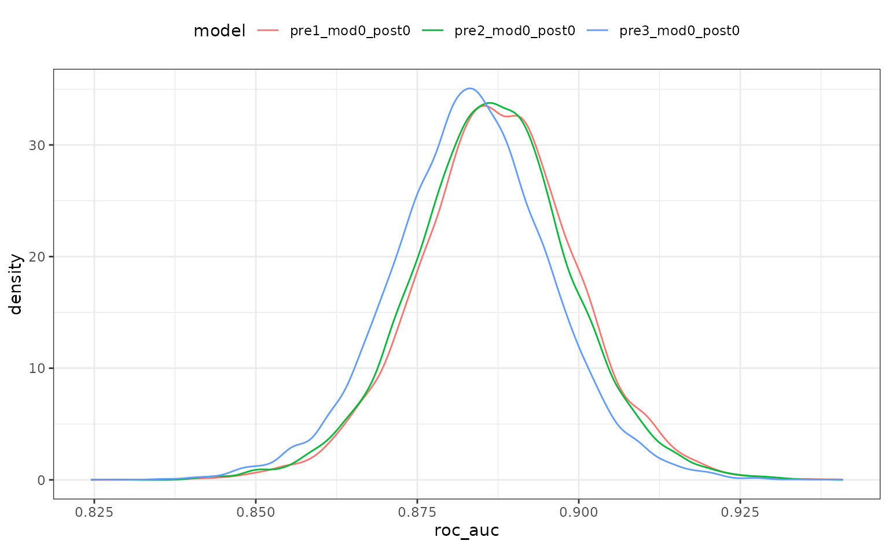

# Getting Started

To show how `tidyposterior` compares models, let’s look at a small data
set. The `modeldata` package has a data set called `two_class_dat` that
has 791 data points on to predictors. The outcome is a two-level factor.
There is some linear-ish separation between the classes but hints that a
nonlinear class boundary might do slightly better.

``` r

library(tidymodels)
library(tidyposterior)

data(two_class_dat)

ggplot(two_class_dat, aes(x = A, y = B, col = Class)) + 
  geom_point(alpha = 0.3, cex = 2) +
  coord_fixed()
```


`tidyposterior` models performance statistics produced by models, such
as RMSE, accuracy, or the area under the ROC curve. It relies on
resampling to produce replicates of these performance statistics so that
they can be modeled.

We’ll use simple 10-fold cross-validation here. Any other resampling
method from `rsample`, except a simple validation set, would also be
appropriate.

``` r

set.seed(1)
cv_folds <- vfold_cv(two_class_dat)
cv_folds
```

    ## #  10-fold cross-validation 
    ## # A tibble: 10 × 2
    ##    splits           id    
    ##    <list>           <chr> 
    ##  1 <split [711/80]> Fold01
    ##  2 <split [712/79]> Fold02
    ##  3 <split [712/79]> Fold03
    ##  4 <split [712/79]> Fold04
    ##  5 <split [712/79]> Fold05
    ##  6 <split [712/79]> Fold06
    ##  7 <split [712/79]> Fold07
    ##  8 <split [712/79]> Fold08
    ##  9 <split [712/79]> Fold09
    ## 10 <split [712/79]> Fold10

We’ll use a logistic regression model for these data and initially
consider two different preprocessing methods that might help the fit.
Let’s define a model specification:

``` r

logistic_spec <- logistic_reg() |> set_engine("glm")
```

## Comparing modeling/prepreocessing methods

One way to incorporate nonlinearity into the class boundary is to use a
spline basis expansion for the predictors. A `recipe` step using
`step_spline_natural` will will encode the predictors in this way. The
degrees of freedom will be hard-coded to produce two additional feature
columns per predictor:

``` r

spline_rec <- 
  recipe(Class ~ ., data = two_class_dat) |> 
  step_spline_natural(A, B, deg_free = 3)

spline_wflow <- 
  workflow() |> 
  add_recipe(spline_rec) |> 
  add_model(logistic_spec)
```

Binding the model and recipe into a workflow creates a simple interface
when we [`fit()`](https://generics.r-lib.org/reference/fit.html) and
[`predict()`](https://rdrr.io/r/stats/predict.html) the data (but isn’t
required by `tidypredict`).

An alternate preprocessing method is to normalize the data using a
spatial sign transformation. This projects the predictors on to a unit
circle and can sometimes mitigate the effect of collinearity or
outliers. A recipe is also used. Here is a visual representation of the
data after the transformation:

``` r

spatial_sign_rec <- 
  recipe(Class ~ ., data = two_class_dat) |> 
  step_normalize(A, B) |> 
  step_spatialsign(A, B)

spatial_sign_rec |> 
  prep() |> 
  bake(new_data = NULL) |> 
  ggplot(aes(x = A, y = B, col = Class)) + 
  geom_point(alpha = 0.3, cex = 2) +
  coord_fixed()
```


Another workflow is created for this method:

``` r

spatial_sign_wflow <- 
  workflow() |> 
  add_recipe(spatial_sign_rec) |> 
  add_model(logistic_spec)
```

`tidyposterior` does not require the user to create their models using
tidymodels packages, `caret`, or any other method (although there are
advantages to using those tools). In the end a data frame format with
resample identifiers and columns for performance statistics are needed.

To produce this format with our tidymodels objects, this small
convenience function will create a model on the 90% of the data
allocated by cross-validation, predict the other 10%, then calculate the
area under the ROC curve. If you use tidymodels, there are high-level
interfaces (shown below) that don’t require such a function.

``` r

compute_roc <- function(split, wflow) {
  # Fit the model to 90% of the data
  mod <- fit(wflow, data = analysis(split))
  # Predict the other 10%
  pred <- predict(mod, new_data = assessment(split), type = "prob")
  # Compute the area under the ROC curve
  pred |> 
    bind_cols(assessment(split)) |> 
    roc_auc(Class, .pred_Class1) |> 
    pull(.estimate)
}
```

For our `rsample` object `cv_folds`, let’s create two columns of ROC
statistics using this function in conjunction with
[`purrr::map`](https://purrr.tidyverse.org/reference/map.html) and
[`dplyr::mutate`](https://dplyr.tidyverse.org/reference/mutate.html):

``` r

roc_values <- 
  cv_folds |> 
  mutate(
    spatial_sign = map_dbl(splits, compute_roc, spatial_sign_wflow),
    splines      = map_dbl(splits, compute_roc, spline_wflow)
  )

roc_values
```

    ## #  10-fold cross-validation 
    ## # A tibble: 10 × 4
    ##    splits           id     spatial_sign splines
    ##    <list>           <chr>         <dbl>   <dbl>
    ##  1 <split [711/80]> Fold01        0.943   0.946
    ##  2 <split [712/79]> Fold02        0.861   0.852
    ##  3 <split [712/79]> Fold03        0.819   0.838
    ##  4 <split [712/79]> Fold04        0.844   0.873
    ##  5 <split [712/79]> Fold05        0.865   0.902
    ##  6 <split [712/79]> Fold06        0.868   0.909
    ##  7 <split [712/79]> Fold07        0.952   0.934
    ##  8 <split [712/79]> Fold08        0.904   0.920
    ##  9 <split [712/79]> Fold09        0.765   0.811
    ## 10 <split [712/79]> Fold10        0.851   0.889

``` r

# Overall ROC statistics per workflow:
summarize(
  roc_values,
  splines = mean(splines),
  spatial_sign = mean(spatial_sign)
)
```

    ## # A tibble: 1 × 2
    ##   splines spatial_sign
    ##     <dbl>        <dbl>
    ## 1   0.887        0.867

There is the suggestion that using splines is better than the spatial
sign. It would be nice to have some inferential analysis that could tell
us if the size of this difference is create than the experimental noise
in the data.

`tidyposterior` uses a Bayesian ANOVA model to compute posterior
distributions for the performance statistic of each modeling method.
This tells use the probabilistic distribution of the model performance
metrics and allows us to make more formal statements about the
superiority (or equivalence) of different models. [*Tidy Models with
R*](https://www.tmwr.org/compare.html#tidyposterior) has a good
explanation of how the Bayesian ANOVA model works.

The main function to conduct the analysis is
[`perf_mod()`](https://tidyposterior.tidymodels.org/dev/reference/perf_mod.md).
The main argument is for the object containing the resampling
information and at least two numeric columns of performance statistics
(measuring the same metric). As described in
[`?perf_mod`](https://tidyposterior.tidymodels.org/dev/reference/perf_mod.md),
there are a variety of other object types that can be used for this
argument.

There are also options for statistical parameters of the analysis, such
as any transformation of the output statistics that should be used and
so on.

The main options in our analysis are passed through to the `rstanarm`
function `stan_glmer()`. These include:

- `seed`: An integer that controls the random numbers used in the
  Bayesian model.

- `iter`: The total number of Montre Carlo iterations used (including
  the burn-in samples).

- `chains`: The number of independent Markov Chain Monte Carlo analyses
  to compute.

- `refresh`: How often to update the log (a value of zero means no
  output).

Other options that can be helpful (but we’ll use their defaults):

- `prior_intercept`: The main argument in this analysis for specifying
  the prior distribution of the parameters.

- `family`: The exponential family distribution for the performance
  statistics.

- `cores`: The number of parallel workers to use to speed-up
  computations.

Our call to this function is:

``` r

rset_mod <- perf_mod(roc_values, seed = 2, iter = 5000, chains = 5, refresh = 0)
```

The [`summary()`](https://rdrr.io/r/base/summary.html) function for this
type of object shows the output from `stan_glmer()`. It’s long, so we
show some of the initial output:

``` r

print(summary(rset_mod), digits = 3)
```

    ## 
    ## Model Info:
    ##  function:     stan_glmer
    ##  family:       gaussian [identity]
    ##  formula:      statistic ~ model + (1 | id)
    ##  algorithm:    sampling
    ##  sample:       12500 (posterior sample size)
    ##  priors:       see help('prior_summary')
    ##  observations: 20
    ##  groups:       id (10)
    ## 
    ## Estimates:
    ##                                     mean   sd     10%    50%    90% 
    ## (Intercept)                        0.867  0.016  0.847  0.867  0.887
    ## modelsplines                       0.020  0.009  0.009  0.020  0.031
    ## b[(Intercept) id:Fold01]           0.060  0.021  0.033  0.060  0.086
    ## 
    ## <snip>

Assuming that our assumptions are appropriate, one of the main things
that we’d like to get out of the object are samples of the posterior
distributions for the performance metrics (per modeling method). The
[`tidy()`](https://generics.r-lib.org/reference/tidy.html) method will
produce a data frame with such samples:

``` r

tidy(rset_mod, seed = 3)
```

    ## # Posterior samples of performance
    ## # A tibble: 25,000 × 2
    ##    model        posterior
    ##    <chr>            <dbl>
    ##  1 spatial_sign     0.850
    ##  2 splines          0.869
    ##  3 spatial_sign     0.860
    ##  4 splines          0.875
    ##  5 spatial_sign     0.851
    ##  6 splines          0.876
    ##  7 spatial_sign     0.851
    ##  8 splines          0.877
    ##  9 spatial_sign     0.852
    ## 10 splines          0.873
    ## # ℹ 24,990 more rows

We require a `seed` value since it is a sample.

There is a simple plotting method for the object too:

``` r

autoplot(rset_mod)
```


There is some overlap but, again, it would be better if we could
quantify this.

To compare models, the
[`contrast_models()`](https://tidyposterior.tidymodels.org/dev/reference/contrast_models.md)
function computes the posterior distributions of differences in
performance statistics between models. For example, what does the
posterior look like for the difference in performance for these two
preprocessing methods? By default, the function computes all possible
differences (a single contrast for this example). There are also
[`summary()`](https://rdrr.io/r/base/summary.html) and plot methods:

``` r

preproc_diff <- contrast_models(rset_mod, seed = 4)
summary(preproc_diff, seed = 5)
```

    ## # A tibble: 1 × 9
    ##   contrast         probability    mean   lower    upper  size pract_neg
    ##   <chr>                  <dbl>   <dbl>   <dbl>    <dbl> <dbl>     <dbl>
    ## 1 spatial_sign vs…      0.0196 -0.0200 -0.0351 -0.00472     0        NA
    ## # ℹ 2 more variables: pract_equiv <dbl>, pract_pos <dbl>

``` r

autoplot(preproc_diff) + 
  xlab("Difference in ROC (spatial sign - splines)")
```

 Since
the difference is negative, the spline model appears better than the
spatial sign method. The summary output quantifies this by producing a
simple credible interval for the difference. The probability column also
reflects this since it is the probability that the spline ROC scores are
greater than the analogous statistics from the spatial sign model. A
value of 0.5 would indicate no difference.

There is an additional analysis that can be used. The ROPE method, short
for *Region of Practical Equivalence*, is a method for understanding the
differences in models in less subjective way. For this analysis, we
would specify a practical effect size (usually before the analysis).
This quantity reflects what difference in the metric is considered
practically meaning full in the context of our problem. In our example,
if we saw two models with a difference in their ROC statistics of 0.02,
we might consider them effectually different (your beliefs may differ).

Once we have settled on a value of this effect size (in the units of the
statistic), we can compute how much of the difference is within this
region of practical equivalence (in our example, this is
`[-0.02, 0.02]`). If the difference is mostly within these bounds, the
models might be significantly different but not practically different.
Alternatively, if the differences are beyond this, they would be
different in both senses.

The summary and plot methods have optional arguments called `size.` The
[`summary()`](https://rdrr.io/r/base/summary.html) function computes the
probability of the posterior differences that fall inside and outside of
this region. The plot method shows it visually:

``` r

summary(preproc_diff, size = 0.02) |> 
  select(contrast, starts_with("pract"))
```

    ## # A tibble: 1 × 4
    ##   contrast                pract_neg pract_equiv pract_pos
    ##   <chr>                       <dbl>       <dbl>     <dbl>
    ## 1 spatial_sign vs splines     0.503       0.497   0.00064

``` r

autoplot(preproc_diff, size = 0.02)
```


For this analysis, there are about even odds that the difference between
these models is not practically important (since the `pract_equiv` is
near 0.5).

### About our assumptions

Previously, the expression “assuming that our assumptions are
appropriate” was used. This is an inferential analysis and the validity
of our assumptions matter a great deal. There are a few assumptions for
this analysis. The main one is that we’ve specified the outcome
distribution well. We’ve models the area under the ROC curve. This is a
statistic bounded (effectively) between 0.5 and 1.0. The variance of the
statistic is probably related to the mean; there is likely less
variation in scores near 1.0 than those near 0.5.

The default family for `stan_glmer()` is Gaussian. Given the
characteristics of this metric, that assumption might seem problematic.

However, Gaussian seems like a good first approach for this assumption.
The rationale is based on the Central Limit Theorem. As the sample size
increases, the sample mean statistic converges to normality despite the
distribution of the individual data points. Our performance estimates
are summary statistics and, if the training set size is “large enough”,
they will exhibit behavior consistent with normality.

As a simple (and approximate) example/diagnostics, suppose we used a
simple ANOVA for the ROC statistics using
[`lm()`](https://rdrr.io/r/stats/lm.html). This is not the same analysis
as the one used by `tidyposterior`, but the regression parameter
estimates should be fairly similar. For that analysis, we can assess the
normality of the residuals and see that they are pretty consistent with
the normality assumption:

``` r

roc_longer <- 
  roc_values |> 
  select(-splits) |> 
  pivot_longer(cols = c(-id), names_to = "preprocessor", values_to = "roc")

roc_fit <- lm(roc ~ preprocessor, roc_longer)

roc_fit |> 
  augment() |> 
  ggplot(aes(sample = .resid)) + 
  geom_qq() + 
  geom_qq_line(lty = 2) +
  coord_fixed(ratio  = 20)
```


If this were not the case there are a few things that we can do.

The easiest approach would be to use a variance stabilizing
transformation of the metrics and keep the Gaussian assumption.
[`perf_mod()`](https://tidyposterior.tidymodels.org/dev/reference/perf_mod.md)
has a `transform` argument that will transform the outcome but still
produce the posterior distributions in the original units. This will
help if the variation within each model significantly changes over the
range of the values. When transformed back to the original units, the
posteriors will have different variances.

Another option that can help with heterogeneous variances is
`hetero_var.` This fits a difference variance for each modeling method.
However, this may make convergence of the model more difficult.

Finally, a different distribution can be assumed using the family
argument to `stan_glmer()`. Since our metrics are numeric, there are not
many families to choose from.

## Evaluating sub-models

The previous example was a between-model comparison (where “model”
really means statistical model plus preprocessing method). If the model
must be tuned, there is also the issue of within-model comparisons.

For our spline analysis, we assumed that three degrees of freedom were
appropriate. However, we might tune the model over that parameter to see
what the best degrees of freedom should be.

The previous spline recipe is altered so that the degrees of freedom
parameter doesn’t have an actual value. Instead, using a value of
[`tune()`](https://hardhat.tidymodels.org/reference/tune.html) will mark
this parameter for optimization. There are a few different approaches
for tuning this parameter; we’ll use simple grid search.

``` r

spline_rec <- 
  recipe(Class ~ ., data = two_class_dat) |> 
  step_spline_natural(A, B, deg_free = tune())
```

The `tune` package function `tune_grid()` is used to evaluate several
values of the parameter. For each value, the resampled area under the
ROC curve is computed.

``` r

spline_tune <-
  logistic_spec |>
  tune_grid(
    spline_rec,
    resamples = cv_folds,
    grid = tibble(deg_free = c(3, 5, 10)),
    metrics = metric_set(roc_auc),
    control = control_grid(save_workflow = TRUE)
  )
collect_metrics(spline_tune) |> 
  arrange(desc(mean))
```

    ## # A tibble: 3 × 7
    ##   deg_free .metric .estimator  mean     n std_err .config        
    ##      <dbl> <chr>   <chr>      <dbl> <int>   <dbl> <chr>          
    ## 1        3 roc_auc binary     0.887    10  0.0137 pre1_mod0_post0
    ## 2        5 roc_auc binary     0.886    10  0.0133 pre2_mod0_post0
    ## 3       10 roc_auc binary     0.883    10  0.0128 pre3_mod0_post0

There is a
[`perf_mod()`](https://tidyposterior.tidymodels.org/dev/reference/perf_mod.md)
method for this type of object. The computations are conducted in the
same manner but, in this instance, three sub-models are compared.

``` r

grid_mod <- perf_mod(spline_tune, seed = 6, iter = 5000, chains = 5, refresh = 0)
autoplot(grid_mod)
```



When the object given to perf_mod is from a model tuning function, the
`model` column corresponds to the `.config` column in the results.

There is a lot of overlap. The results do call into question the overall
utility of using splines. A single degree of freedom model corresponds
to a linear effect. Let’s compare the linear class boundaries to the
other sub-models to see if splines are even improving the model.

The contrast_model function can take two lists of model identifiers and
compute their differences. Again, for tuning objects, this should
include values of `.config`. This specification compute the difference
`{1 df - X df}` so positive differences indicate that the linear model
is better.

``` r

grid_diff <-
  contrast_models(
    grid_mod,
    list_1 = rep("pre1_mod0_post0", 2),
    list_2 = c(
      "pre2_mod0_post0", # <-  5 df spline
      "pre3_mod0_post0"  # <- 10 df spline
    ),
    seed = 7
  )
```

``` r

summary(grid_diff)
```

    ## # A tibble: 2 × 9
    ##   contrast         probability    mean    lower   upper  size pract_neg
    ##   <chr>                  <dbl>   <dbl>    <dbl>   <dbl> <dbl>     <dbl>
    ## 1 pre1_mod0_post0…       0.579 8.17e-4 -0.00575 0.00736     0        NA
    ## 2 pre1_mod0_post0…       0.857 4.17e-3 -0.00240 0.0108      0        NA
    ## # ℹ 2 more variables: pract_equiv <dbl>, pract_pos <dbl>

``` r

autoplot(grid_diff)
```


The results indicate that a lot of degrees of freedom might make the
model worse. At best, there is a limited difference in performance when
more than one spline term is used.

The ROPE analysis is more definitive; there is no sense of practical
differences within the previously used effect size:

``` r

autoplot(grid_diff, size = 0.02)
```


## Workflow sets

Workflow sets are collections of workflows and their results. These can
be made after existing workflows have been evaluated or by using
[`workflow_set()`](https://workflowsets.tidymodels.org/reference/workflow_set.html)
to create an evaluate the models.

Let’s create an initial set that has difference combinations of the two
predictors for this data set.

``` r

library(workflowsets)

logistic_set <- 
  workflow_set(
    list(A = Class ~ A, B = Class ~ B, ratio = Class ~ I(log(A/B)), 
         spatial_sign = spatial_sign_rec),
    list(logistic = logistic_spec)
  )
logistic_set
```

    ## # A workflow set/tibble: 4 × 4
    ##   wflow_id              info             option    result    
    ##   <chr>                 <list>           <list>    <list>    
    ## 1 A_logistic            <tibble [1 × 4]> <opts[0]> <list [0]>
    ## 2 B_logistic            <tibble [1 × 4]> <opts[0]> <list [0]>
    ## 3 ratio_logistic        <tibble [1 × 4]> <opts[0]> <list [0]>
    ## 4 spatial_sign_logistic <tibble [1 × 4]> <opts[0]> <list [0]>

The `object` volumn contains the workflows that are created by the
combinations of preprocessors and the model (multiple models could have
been used). Rather than calling the same functions from the `tune`
package repeatedly, we can evaluate these with a single function call.
Notice that none of these workflows require tuning so
[`tune::fit_resamples()`](https://tune.tidymodels.org/reference/fit_resamples.html)
can be used:

``` r

logistic_res <- 
  logistic_set |> 
  workflow_map("fit_resamples", seed = 3, resamples = cv_folds, 
               metrics = metric_set(roc_auc)) 
logistic_res
```

    ## # A workflow set/tibble: 4 × 4
    ##   wflow_id              info             option    result   
    ##   <chr>                 <list>           <list>    <list>   
    ## 1 A_logistic            <tibble [1 × 4]> <opts[2]> <rsmp[+]>
    ## 2 B_logistic            <tibble [1 × 4]> <opts[2]> <rsmp[+]>
    ## 3 ratio_logistic        <tibble [1 × 4]> <opts[2]> <rsmp[+]>
    ## 4 spatial_sign_logistic <tibble [1 × 4]> <opts[2]> <rsmp[+]>

``` r

collect_metrics(logistic_res) |> 
  filter(.metric == "roc_auc")
```

    ## # A tibble: 4 × 9
    ##   wflow_id .config preproc model .metric .estimator  mean     n std_err
    ##   <chr>    <chr>   <chr>   <chr> <chr>   <chr>      <dbl> <int>   <dbl>
    ## 1 A_logis… pre0_m… formula logi… roc_auc binary     0.702    10  0.0210
    ## 2 B_logis… pre0_m… formula logi… roc_auc binary     0.866    10  0.0151
    ## 3 ratio_l… pre0_m… formula logi… roc_auc binary     0.749    10  0.0164
    ## 4 spatial… pre0_m… recipe  logi… roc_auc binary     0.867    10  0.0176

We can also add the previously tuned spline results by first converting
them to a workflow set then appending their rows to the results:

``` r

logistic_res <- 
  logistic_res |> 
  bind_rows(
    as_workflow_set(splines = spline_tune)
  )
logistic_res
```

    ## # A workflow set/tibble: 5 × 4
    ##   wflow_id              info             option    result   
    ##   <chr>                 <list>           <list>    <list>   
    ## 1 A_logistic            <tibble [1 × 4]> <opts[2]> <rsmp[+]>
    ## 2 B_logistic            <tibble [1 × 4]> <opts[2]> <rsmp[+]>
    ## 3 ratio_logistic        <tibble [1 × 4]> <opts[2]> <rsmp[+]>
    ## 4 spatial_sign_logistic <tibble [1 × 4]> <opts[2]> <rsmp[+]>
    ## 5 splines               <tibble [1 × 4]> <opts[0]> <tune[+]>

There are some convenience functions to take an initial look at the
results:

``` r

rank_results(logistic_res, rank_metric = "roc_auc") |> 
  filter(.metric == "roc_auc")
```

    ## # A tibble: 7 × 9
    ##   wflow_id .config .metric  mean std_err     n preprocessor model  rank
    ##   <chr>    <chr>   <chr>   <dbl>   <dbl> <int> <chr>        <chr> <int>
    ## 1 splines  pre1_m… roc_auc 0.887  0.0137    10 recipe       logi…     1
    ## 2 splines  pre2_m… roc_auc 0.886  0.0133    10 recipe       logi…     2
    ## 3 splines  pre3_m… roc_auc 0.883  0.0128    10 recipe       logi…     3
    ## 4 spatial… pre0_m… roc_auc 0.867  0.0176    10 recipe       logi…     4
    ## 5 B_logis… pre0_m… roc_auc 0.866  0.0151    10 formula      logi…     5
    ## 6 ratio_l… pre0_m… roc_auc 0.749  0.0164    10 formula      logi…     6
    ## 7 A_logis… pre0_m… roc_auc 0.702  0.0210    10 formula      logi…     7

``` r

autoplot(logistic_res, metric = "roc_auc")
```


The
[`perf_mod()`](https://tidyposterior.tidymodels.org/dev/reference/perf_mod.md)
method for workflow sets takes the best submodel from each workflow and
then uses the standard `tidyposterior` analysis:

``` r

roc_mod <- perf_mod(logistic_res, metric = "roc_auc", seed = 1, refresh = 0)
```

The results of this call produces an object with an additional class to
enable some
[`autoplot()`](https://ggplot2.tidyverse.org/reference/autoplot.html)
methods specific to workflow sets. For example, the default plot shows
90% credible intervals for the best results in each workflow:

``` r

autoplot(roc_mod)
```


Alternatively, the ROPE estimates for a given since can be computed to
compare the numerically best workflow to the others. The probability of
practical equivalence is shown for all results:

``` r

autoplot(roc_mod, type = "ROPE", size = 0.025)
```


